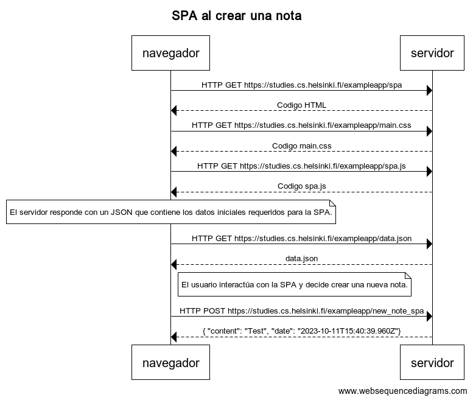

# SPA al crear una nota

- navegador->servidor: HTTP GET https://studies.cs.helsinki.fi/exampleapp/spa
- servidor-->navegador: Codigo HTML
- navegador->servidor:HTTP GET https://studies.cs.helsinki.fi/exampleapp/main.css
- servidor-->navegador: Codigo main.css 
- navegador->servidor: HTTP GET https://studies.cs.helsinki.fi/exampleapp/spa.js
- servidor-->navegador: Codigo spa.js
- note over navegador: El servidor responde con un JSON que contiene los datos iniciales requeridos para la SPA.

- navegador->servidor: HTTP GET https://studies.cs.helsinki.fi/exampleapp/data.json
- servidor-->navegador: data.json
- 
- note right of navegador: El usuario interactúa con la SPA y decide crear una nueva nota.
- navegador->servidor: HTTP POST https://studies.cs.helsinki.fi/exampleapp/new_note_spa
- servidor-->navegador:{ "content": "Test", "date": "2023-10-11T15:40:39.960Z"}

