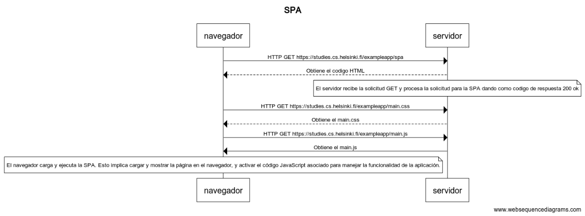

# SPA

- navegador->servidor: HTTP GET https://studies.cs.helsinki.fi/exampleapp/spa
- servidor-->navegador: Obtiene el codigo HTML
- note over servidor:El servidor recibe la solicitud GET y procesa la solicitud para la SPA - dando como codigo de respuesta 200 ok 
- navegador->servidor: HTTP GET https://studies.cs.helsinki.fi/exampleapp/main.css
- servidor-->navegador: Obtiene el main.css

- navegador->servidor: HTTP GET https://studies.cs.helsinki.fi/exampleapp/main.js
- servidor->navegador: Obtiene el main.js
- note over navegador: El navegador carga y ejecuta la SPA. Esto implica cargar y mostrar la - página en el navegador, y activar el código JavaScript asociado para manejar la funcionalidad de la aplicación.
